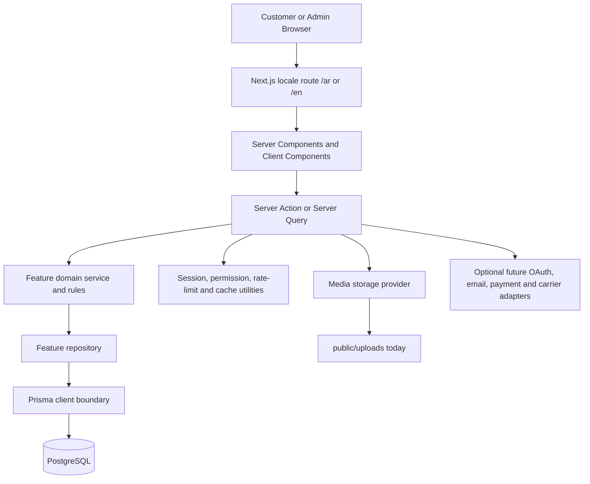
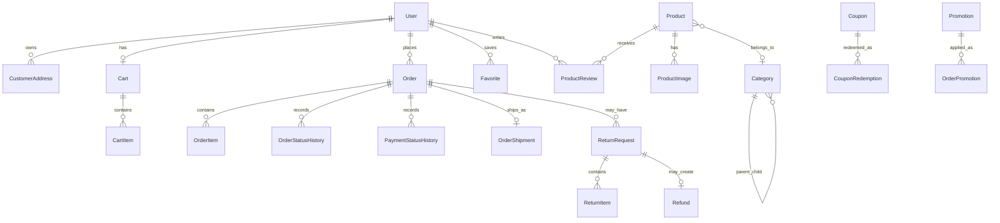

# Maharat Kids — Ecommerce Template Discovery & Business Audit

**Audit date:** 2026-09-19  
**Repository:** `https://github.com/ahmedAbdelal96/store-ecommerce-template.git`  
**Checked-out project folder:** `D:\Web\Projects\NextJs\01-ecommerce projects\maharat-kids`  
**Audited revision:** `09f78c0 Complete bilingual locale foundation`

## 1. Project overview

This is a reusable, single-store ecommerce foundation. It is not a multi-tenant SaaS product. One deployment owns one catalog, one customer base, and one administration area.

The repository is a relatively mature foundation rather than a small storefront starter. It includes customer authentication, catalog management, cart and checkout, order/payment/shipping operations, inventory, coupons, promotions, reviews, favorites, notifications, returns/refunds, customer segmentation, audit logs, bilingual Arabic/English routing, and an admin foundation.

The seeded catalog is demo technology merchandise; business branding, catalog content, Saudi operating rules, and external service adapters remain application work.

### Setup and verification results

| Check | Result | Evidence |
|---|---|---|
| Exact repository | Passed | `ahmedAbdelal96/store-ecommerce-template.git` |
| Dependencies | Passed | `npm ci`; Prisma client generated explicitly |
| Prisma schema | Passed | `prisma validate` |
| Database connection | Passed | PostgreSQL 17 local service; 22 migrations already applied |
| Database seed | Passed | `prisma db seed` completed |
| TypeScript | Passed | `npm exec -- tsc --noEmit` |
| Production build | Passed | `npm run build`; all application routes compiled |
| Lint | Passed | `npm run lint` exited without reported errors |
| Dev server | Passed | `npm run dev` ready at `http://localhost:3000` |
| Public Arabic storefront | Passed | `GET /ar` → 200 |
| Public English storefront | Passed | `GET /en` → 200 |
| Product listing | Passed | `GET /ar/products` → 200 |
| Health endpoint | Passed | `GET /api/health` → `{"status":"ok",...}` |
| Admin protection | Passed | `GET /ar/admin` redirects unauthenticated users to login |

## 2. Technology and architecture audit

### Technology stack

- **Framework:** Next.js 16.3.2 App Router with Turbopack.
- **Language:** TypeScript 5.x, React 19.
- **Styling/UI:** Tailwind CSS 4, local UI primitives, Lucide icons, Framer Motion.
- **Internationalization:** `next-intl`; `/ar` and `/en` locale segments; Arabic is the default locale and uses RTL direction.
- **Database:** PostgreSQL 14+ compatible; verified against local PostgreSQL 17.
- **ORM:** Prisma 6.19.3 in the installed environment, with committed migrations and generated client.
- **Validation:** Zod schemas at module boundaries.
- **Authentication:** Custom server-managed sessions; scrypt password hashing; HTTP-only session token handling; optional Google OAuth; password reset codes.
- **Authorization:** Admin-only RBAC with roles, permissions, guards, and audit logging. Customer accounts are separate from administration roles.
- **State management:** No global client state library. Server Components, server actions, URL/query state, and focused local React state are used. Cart state is server/database-backed with a guest token cookie.
- **API architecture:** Mostly server actions and server queries behind feature modules. Small route handlers exist for health, search suggestions, Google callbacks, and customer-segment export. This is not a REST-first or GraphQL-first API.
- **Payments:** Payment method records and payment status/settlement workflows exist. The gateway interface is currently a null adapter; no live Saudi gateway implementation is present.
- **Media storage:** Current provider writes files to `public/uploads` on the application filesystem. A provider interface exists for replacing it later.
- **Deployment shape:** A Node-compatible Next.js deployment with persistent PostgreSQL and durable media storage. Vercel-style ephemeral filesystem deployment is unsafe without replacing local media storage.

### Architecture

The feature-based module convention is strong: each domain generally owns `domain`, `server`, `infrastructure`, `components`, schemas, and types. `src/app` is intentionally a routing layer and does not own business logic. This should be preserved during Maharat Kids customization.

### Project structure

- `src/app`: locale-aware storefront/admin routes and a small set of API handlers.
- `src/modules`: identity, auth, customers, products, categories, media, inventory, cart, orders, payments, shipping, promotions, coupons, favorites, reviews, notifications, returns, dashboard, admin, and audit modules.
- `src/components`: shared ecommerce, layout, SEO, motion, UI, and state presentation components.
- `src/core`: errors, results, permissions, constants, and shared types.
- `src/server`: auth, database access, caching, logging, observability, permissions, and rate limiting.
- `prisma`: schema, 22 migrations, and idempotent development seed.
- `docs`: ADRs and operational/development guidance.

## 3. Existing business features

### Customer features

| Feature | Status | Notes |
|---|---|---|
| Registration/login | Available | Email/password with server sessions and password hashing |
| Mobile authentication | Missing | A phone field exists, but phone/OTP login is not implemented |
| Email authentication | Available | Email/password; password reset uses short-lived codes |
| Google customer sign-in | Optional/partial | OAuth routes and provider exist; credentials are optional and not configured locally |
| Guest cart | Available | Anonymous cart uses a hashed guest token cookie and merges after login |
| Guest checkout | Missing by design | Checkout remains customer-only; guests are sent to login |
| Profile | Available | Customer account, name, phone, marketing consent, and account views |
| Saved addresses | Available | Customer addresses with default selection and Saudi-compatible address fields |
| Wishlist | Available | Implemented as Favorites, with customer UI and database model |
| Product comparison | Missing | No comparison model, route, or service |
| Reviews | Available | Verified-purchase reviews, one review per customer/product, moderation |
| Ratings | Available | Integer rating and aggregate display |
| Notifications | Available | In-app notifications for order/payment/return/review lifecycle events; no push/SMS provider |

### Product and catalog management

| Capability | Status | Notes |
|---|---|---|
| Product model | Available | Name, localized text, slug, SKU, status, price, compare-at price, featured flag |
| Product variants | Missing | `CartItem.variantId` is only a nullable string; there is no Variant model or variant inventory/pricing |
| Attributes | Missing | No attribute/value schema or product-option administration |
| Categories | Available | Hierarchical categories, localized text, sort order, status, images |
| Brands | Missing | No brand entity or admin flow |
| Tags | Missing | No persisted tag entity; preview data contains presentation-only tags |
| Multiple images | Available | Ordered primary/secondary product images through `Media` and `ProductImage` |
| Product videos | Missing | Media is file-oriented, but there is no product-video relation or storefront player workflow |
| Stock management | Available, basic | Per-product stock quantity, tracking toggle, inventory admin, and order-time checks |
| SKU | Available | Optional unique SKU with product validation/admin handling |
| Pricing | Available | Decimal price and compare-at price; order items snapshot commercial values |
| Discount pricing | Partial/available | Compare-at pricing plus automatic promotions and coupon discounts; no scheduled price-list engine |

### Shopping experience

- Product detail, category pages, product listing, featured products, hero/banner presentation, quick view, gallery, ratings, related merchandising, and responsive cart UI exist.
- Search exists through a feature module and a suggestions API. Search is application/database based, not a dedicated search engine.
- Filtering and sorting exist at the product-listing query/UI level.
- Cart supports authenticated customers and guests, quantity changes, availability checks, coupon application, and guest-cart merge.
- Checkout collects a saved customer address, a configured payment method, cart snapshot, discounts, delivery amount, and currency.
- Orders are created transactionally from the cart; prices, address, payment selection, promotions, and coupon values are snapshotted.
- The current checkout is not guest checkout and does not integrate with a live online payment processor.

### Order management

- **Order statuses:** `PENDING`, `CONFIRMED`, `PROCESSING`, `SHIPPED`, `OUT_FOR_DELIVERY`, `DELIVERED`, `COMPLETED`, `CANCELLED`.
- **Payment statuses:** `UNPAID`, `PENDING`, `PENDING_VERIFICATION`, `PAID`, `PARTIALLY_REFUNDED`, `FAILED`, `REFUNDED`.
- **Shipment statuses:** assignment, ready for shipping, with carrier, out for delivery, delivered, delivery failed, returning, returned to store.
- **Cancellation:** domain rules and administrative/customer order flows exist, with state transition checks.
- **Returns:** customer return request flow, eligibility window/policy, item-level return records, admin review, and status transitions exist.
- **Refunds:** manual refund records and methods exist, including original payment method as a record. Gateway refund APIs are not implemented.
- **Order history:** customer order listing/detail pages and admin order operations exist.
- **COD:** COD payment and carrier settlement concepts are modeled, including settlement batches and reconciliation records, but carrier API integration is absent.

### Admin panel

Available routes cover dashboard, products, categories, inventory, orders, payments, shipping companies/shipments, returns, reviews, coupons, promotions, customers, customer segments/export, users/roles/permissions, settings, and audit log.

Reports are currently dashboard summaries and operational lists, not a full analytics/reporting warehouse. Settings include store configuration such as business details and currency, but the checked-in defaults are generic and the seed catalog is not Maharat Kids content.

### Marketing and growth

- Coupon codes: available, with fixed/percentage evaluation, validity/usage limits, customer/order redemption records, and reversal handling.
- Promotions/campaigns: available, including automatic promotions, qualifying/gift products, localized promotion content, and hero campaign/banner media.
- Banners/featured products: available in storefront/admin foundation.
- Blog/CMS: missing. No post, author, content block, or editorial publishing model/routes.
- SEO: partial/available foundation. Metadata, localized SEO fields for products/categories/promotions, JSON-LD, sitemap, robots, and canonical-style route support exist.
- Analytics: missing as an integrated product. Audit logs and operational/customer intelligence are not a replacement for web analytics, attribution, pixels, or event pipelines.

## 4. Database audit

### Complete Prisma entity map

#### Identity, access, and authentication

- `User`: email, name, phone, password hash, type/status, marketing consent, login timestamps/counter.
- `Role`, `Permission`, `UserRole`, `RolePermission`: admin RBAC many-to-many graph.
- `Session`: hashed server session token, expiry, user relation.
- `OAuthAccount`: external provider identity link.
- `PasswordResetCode`: hashed, expiring reset code with attempt/verification/use timestamps.

#### Customer engagement

- `CustomerAddress`: recipient and phone, country/governorate/city/area, street/building/floor/apartment/postal code/notes, default flag.
- `Favorite`: customer/product unique saved item.
- `Notification`: typed in-app event, title/message/link, read timestamp, dedupe key.
- `ProductReview`: customer/product/order-item relation, rating/comment, moderation status and moderator.

#### Store and catalog

- `StoreSetting`: application-wide key/value JSON settings.
- `Media`: URL/path, filename, MIME type, byte size, dimensions.
- `Category`: self-referencing hierarchy, slug, text, status, sort order, optional image.
- `CategoryTranslation`: Arabic/English localized category text and SEO fields.
- `Product`: slug, SKU, price, compare-at price, status, featured flag, category, inventory tracking/quantity.
- `ProductTranslation`: Arabic/English product content and SEO fields.
- `ProductImage`: product/media relation, legacy URL fallback, alt text, ordering, primary flag.

#### Cart and orders

- `Cart`: customer or guest ownership, optional applied coupon, timestamps.
- `CartItem`: product snapshot fields, quantity, optional unimplemented `variantId` string.
- `Order`: order number, checkout token, customer, state, currency, authoritative totals, address/payment snapshots, timestamps.
- `OrderItem`: product/order relation, commercial snapshot, quantity, promotion-gift flag, optional `variantId` string.
- `OrderStatusHistory`: order state audit history and actor.
- `PaymentStatusHistory`: payment state audit history and actor/notes.
- `PaymentMethod`: configured method type, name, instructions, destination, active state.
- `PaymentSettlement`: payment settlement/collection record.
- `OrderShipment`: order/shipping-company relation, tracking and shipment state/cost fields.
- `ShipmentStatusHistory`: shipment state history, actor, failure reason/notes.
- `ReturnRequest`, `ReturnItem`, `ReturnStatusHistory`: return workflow, item quantities/reasons, status history.
- `Refund`: return-linked manual refund amount/method/status/processor.

#### Shipping and carrier operations

- `ShippingCompany`: carrier name/configuration and active state.
- `CarrierSettlementBatch`, `CarrierSettlementItem`: carrier COD receivable and settlement reconciliation.

#### Promotions and audit

- `Promotion`: promotion type, schedule/status/limits, discount/gift configuration, qualifying/gift product relations, optional banner media.
- `PromotionTranslation`: localized promotional content.
- `OrderPromotion`: order-level applied promotion snapshot.
- `Coupon`: code/type/value, validity, usage limits and eligibility configuration.
- `CouponRedemption`: customer/order redemption and reversal state.
- `OrderCoupon`: order-level applied coupon snapshot.
- `AuditLog`: actor, action, entity, sanitized metadata, and audit timestamp.

### Database relationships (high level)

### Important missing ecommerce entities

1. `ProductVariant`, `ProductOption`, `ProductOptionValue`, and variant-level price/stock/SKU/media.
2. `Brand`, `Tag`, `ProductTag`, and merchandising/tag administration.
3. Product/video asset relation and video metadata.
4. Educational taxonomy: age range, grade, subject, skill, learning objective, difficulty, curriculum, and language.
5. Saudi geography/serviceability model: region/city/district normalization and carrier zone/rate tables.
6. Tax/VAT invoice model if Saudi tax invoicing is required.
7. Payment transaction/provider/webhook model for idempotent online payment attempts.
8. CMS/blog/content-block entities.
9. Analytics/event/attribution model or external event integration.
10. Product comparison state/entity if comparison is a required customer feature.

## 5. Business suitability for Maharat Kids Saudi Ecommerce

### Overall assessment

**Suitability: High as a foundation; not launch-ready for Saudi operations without a focused integration and catalog phase.**

The template already solves much of the difficult transactional foundation: customer/account boundaries, cart/order snapshots, inventory checks, coupon/promotion rules, order state history, returns/refunds records, RBAC, Arabic/English routing, RTL direction, localizable content, and operational admin screens. That makes it a good base for Maharat Kids.

The main gaps are domain-specific rather than foundational: educational discovery, product variants, Saudi authentication/payment/shipping, durable media, tax/invoice requirements, and production observability/analytics.

| Maharat Kids requirement | Fit | Assessment |
|---|---|---|
| Educational products | Partial | Product/catalog foundation exists; educational metadata is absent |
| Kids categories | Good | Hierarchical categories and localized content exist |
| Age-based classification | Missing | Add structured age bands, not free-text tags |
| Skill-based classification | Missing | Add skills/learning objectives and many-to-many product relations |
| Saudi customers | Partial | Address fields and Arabic locale help; Saudi identity/service integrations absent |
| Mobile login | Missing | Add Saudi phone normalization, OTP provider, abuse controls, and account linking |
| Shipping integration | Partial | Internal shipping/COD operations exist; carrier APIs/rates/tracking webhooks absent |
| Arabic RTL | Good | Arabic default, RTL direction, locale routes, localized catalog fields |
| SAR currency | Partial | Currency is configurable and order-snapshotted; defaults/formatters are generic USD and need a Saudi configuration pass |
| Coupon system | Good | Coupon and promotion engine is a strong starting point |
| Future scalability | Partial | Modular domain boundaries are strong; storage, rate limiting, jobs, search, and integrations need production hardening |

### Recommended Maharat Kids domain additions

- Add `AgeGroup` with a controlled range such as 0–2, 3–5, 6–8, 9–12, 13+; use explicit min/max age and display label.
- Add `Skill` and `LearningObjective`, with product many-to-many relations.
- Add `Subject`/`LearningArea` and possibly `Curriculum` only if catalog merchandising requires them.
- Add product language, educational level, material/safety information, package dimensions, and recommended supervision fields where relevant.
- Add variants for size, color, bundle, kit composition, or edition where a product can have separate SKU/stock/price.
- Configure Arabic-first product/category/promotion content and Saudi-specific copy; keep English as a maintained secondary locale.

## 6. Missing features and risk points

### Launch-blocking or high-priority gaps

1. **Online payment provider:** `getPaymentGateway()` currently returns `null`; there is no Moyasar, HyperPay, Tabby/Tamara, STC Pay, or other Saudi provider adapter, payment intent lifecycle, webhook verification, or gateway refund call.
2. **Shipping carrier integration:** carrier records and shipment workflows are internal/manual. No rate quote, label, pickup, tracking webhook, address serviceability, or carrier reconciliation API is connected.
3. **Mobile OTP authentication:** phone is a profile field only. Saudi phone OTP, resend limits, provider delivery, fraud controls, and account recovery are absent.
4. **Durable media:** local `public/uploads` is appropriate for development/single-server use only. Use S3-compatible object storage or a Saudi/production-approved media service before autoscaling or ephemeral deployment.
5. **Variants:** the string fields in cart/order items do not constitute variant support. Do not build educational kits/sizes around that placeholder.
6. **VAT/invoicing:** verify whether Maharat Kids requires Saudi VAT-compliant invoices, tax numbers, invoice numbering, credit notes, and integration with accounting/e-invoicing requirements.

### Scalability and operational risks

- Rate limiting is process-local; multi-instance deployment requires a shared store or edge gateway.
- Search is database/application based and may require a dedicated search index as the catalog grows.
- No job/queue layer is present for email, SMS, webhooks, fulfillment synchronization, or retryable notifications.
- Analytics, attribution, consent, and marketing event tracking are not integrated.
- Admin audit logs intentionally do not replace customer activity analytics.
- Localized catalog data is strong, but historical order snapshots are intentionally immutable and may preserve the language used at order time.
- Seed data and generic store defaults must be replaced before any non-development deployment.
- `package.json#prisma` configuration is deprecated in Prisma 7; plan a future migration to `prisma.config.ts` during dependency upgrades.

## 7. Recommended customization plan

### Phase 0 — Product and Saudi operating decisions

- Confirm the Maharat Kids catalog taxonomy, age bands, skill taxonomy, product types, kits/bundles, and variant rules.
- Confirm Saudi regions/cities, shipping promises, return window, COD policy, VAT/invoice requirements, and payment providers.
- Define Arabic/English content ownership and SEO keyword strategy.

### Phase 1 — Brand, catalog, and localization

- Replace generic store settings, seed catalog, imagery, copy, metadata, and demo credentials.
- Set `SAR` as the store currency and verify Arabic currency display, rounding, and order snapshots.
- Add educational taxonomy entities and admin management.
- Add brand/tag/attribute structures only where they serve real catalog navigation.
- Add product variants before loading products that require them.

### Phase 2 — Saudi customer and checkout foundation

- Implement phone-number normalization and OTP authentication through a selected provider.
- Keep email/password as a fallback or account-recovery path where appropriate.
- Decide whether guest checkout is commercially required; if yes, extend the existing guest-cart continuity rather than bypassing customer/order safeguards.
- Add Saudi address validation/serviceability and a VAT/invoice design.

### Phase 3 — Payment and shipping integrations

- Implement one payment provider behind the existing gateway interface first.
- Add signed webhook handling, idempotency keys, transaction attempts, reconciliation, and provider refund operations.
- Add one carrier integration with quote/rate, shipment creation, tracking, delivery updates, failed-delivery, and COD settlement synchronization.
- Keep manual payment/shipping workflows as operational fallbacks.

### Phase 4 — Production readiness

- Move media to durable object storage and add image transformation/optimization policy.
- Add a shared rate-limit store, queue/worker for external operations, structured logs, alerting, backups, and restore drills.
- Add analytics/consent events, conversion tracking, search monitoring, and operational dashboards.
- Add automated tests for educational filters, variants, coupon edge cases, payment webhooks, shipping status transitions, VAT totals, Arabic/RTL checkout, and return/refund policy.

### Phase 5 — Growth features

- Add comparison only if customer research supports it.
- Add CMS/blog/editorial content, landing campaigns, educational buying guides, and structured SEO content.
- Add bundles/kits, recommendations, back-in-stock alerts, abandoned-cart messaging, and loyalty only after core conversion and fulfillment metrics are stable.

## 8. Final recommendation

Proceed with this template as the Maharat Kids application foundation. Preserve the modular architecture and server-side domain boundaries. Treat the current payment gateway, carrier integration, phone authentication, media storage, variants, and educational taxonomy as explicit implementation tracks—not as configuration-only work.

The repository is locally runnable and structurally sound. It is suitable for a Saudi educational ecommerce build after the high-priority integration and domain phases above; it should not be promoted to production as-is.
